# DR Modelagem — Seu Estúdio na Palma da Mão

  

  <strong>O app que organiza tudo do seu estúdio de modelagem.</strong> 
  Crie orçamentos profissionais, controle despesas e nunca mais perca um prazo. 
  Feito sob medida para o dia a dia da Débora da Rosa.

---

## O que você pode fazer aqui

**Criar orçamentos bonitos em minutos** — escolha o cliente, adicione os serviços e o valor é calculado automaticamente. Envie por WhatsApp ou baixe o PDF com a logo do estúdio.

**Replicar graduação e piloto com um toque** — adicionou 5 moldes? Replique para Graduação e o sistema aplica os 25% automaticamente. Para Peça Piloto, aplica 50%. Sem calculadora.

**Acompanhar o que está pendente** — o painel mostra quantos orçamentos estão aguardando resposta, quanto você faturou no mês e o que precisa ser feito hoje.

**Registrar despesas na hora** — gastou com Uber ou material? Registre direto no celular e o app calcula o km rodado para você.

**Manter o foco no trabalho** — o timer Pomodoro ajuda você a se concentrar por 25 minutos de cada vez. As tarefas aparecem automaticamente quando um orçamento é aprovado.

**Receber lembretes no Telegram** — o app avisa quando um prazo se aproxima, quando um orçamento está sem resposta há dias e envia um resumo diário de pendências.

---

## Telas do app

### Entrar no app

  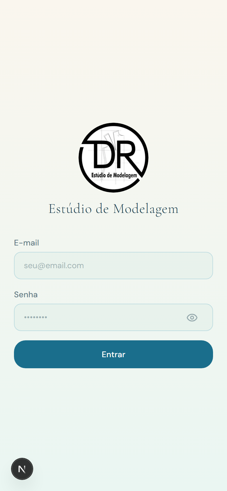

Use seu e-mail e senha para entrar. O app lembra do seu login, então você não precisa digitar toda vez.

---

### Sua página inicial

  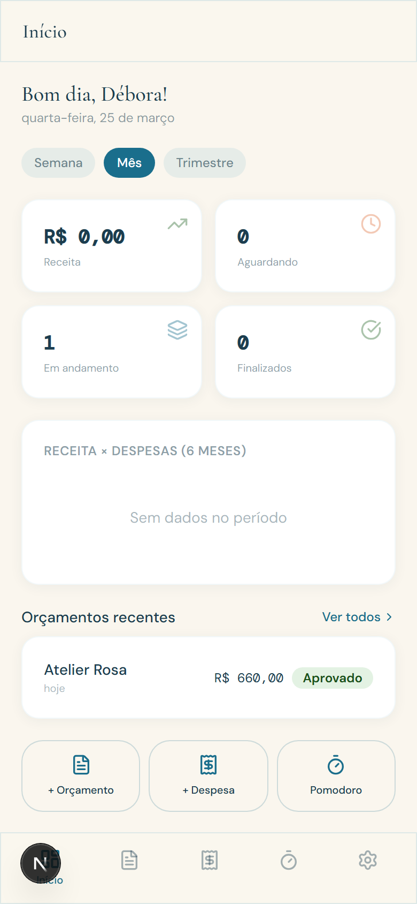

Ao abrir o app, você vê tudo de uma vez: receita do mês, orçamentos pendentes, gráfico dos últimos 6 meses e atalhos rápidos para criar orçamento, registrar despesa ou iniciar o Pomodoro.

**Dica:** Toque em "Semana", "Mês" ou "Trimestre" para mudar o período dos dados.

---

### Seus orçamentos

  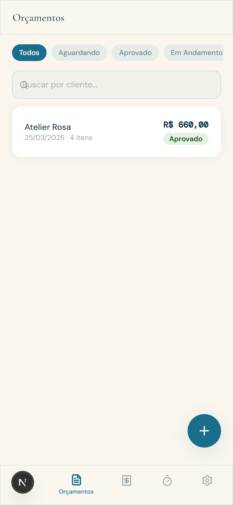

Todos os seus orçamentos em um só lugar. Filtre por status (Aguardando, Aprovado, Em Andamento, Finalizado) ou busque pelo nome do cliente. O botão azul no canto inferior cria um novo orçamento.

---

### Criando um novo orçamento

  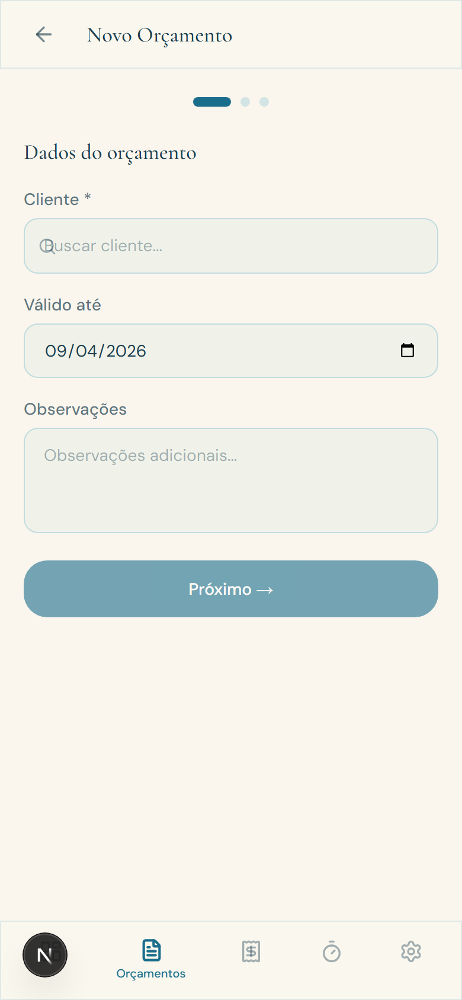

O orçamento é criado em 3 passos simples:

1. **Escolha o cliente** — se ele não existir, cadastre ali mesmo sem sair da tela
2. **Adicione os serviços** — o valor da tabela já vem preenchido, mas você pode ajustar
3. **Revise e confirme** — veja o total, aplique desconto se quiser e pronto

---

### Detalhes do orçamento

  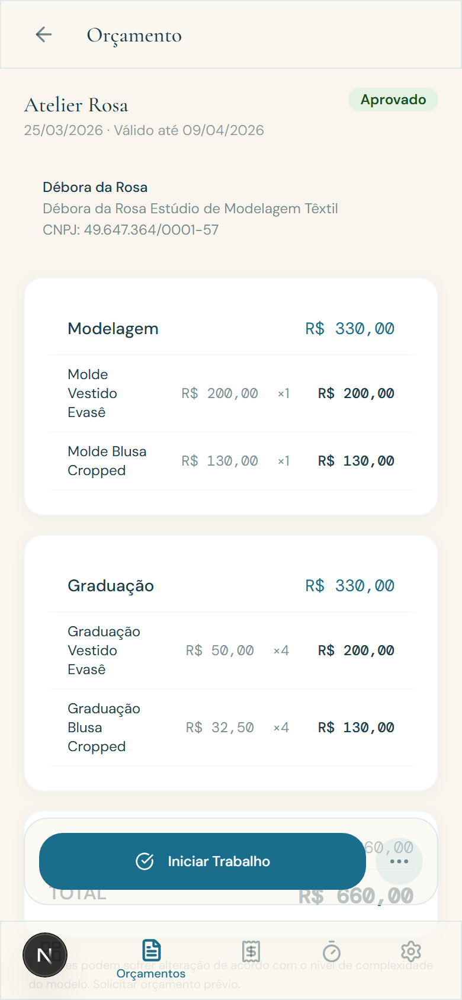

Depois de criar, você pode:
- **Mudar o status** (Aguardando → Aprovado → Em Andamento → Finalizado)
- **Gerar PDF** com a logo do estúdio e o CNPJ
- **Enviar por WhatsApp** com uma mensagem formatada
- **Duplicar** para criar orçamentos parecidos mais rápido
- **Editar** qualquer valor a qualquer momento

**Quando você marca como "Aprovado", uma tarefa é criada automaticamente no seu Foco.**

---

### Suas despesas

  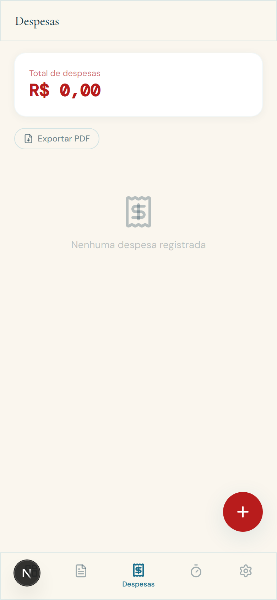

Registre cada gasto do dia. As despesas ficam organizadas por mês com o total em destaque. Você pode vincular a despesa a um cliente e exportar um relatório em PDF.

**Para deslocamento:** digite os quilômetros e o app calcula o valor automaticamente (km x R$ 1,50).

---

### Foco e tarefas

  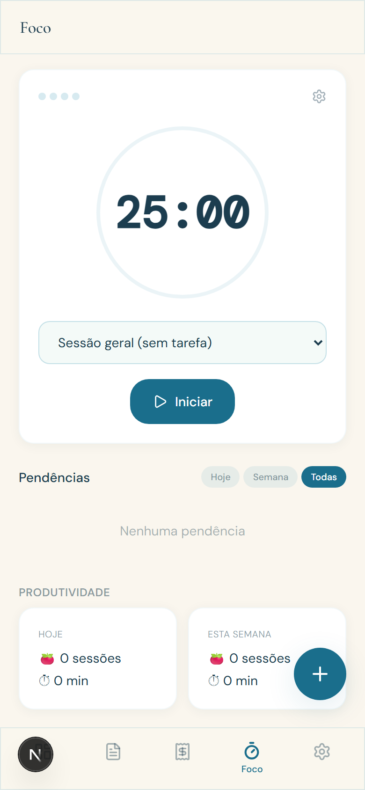

O **Timer Pomodoro** ajuda você a se concentrar: 25 minutos trabalhando, 5 minutos de pausa. Um som toca quando o tempo acaba. Você pode vincular o timer a uma tarefa específica.

As **pendências** aparecem logo abaixo — incluindo as tarefas criadas automaticamente quando um orçamento é aprovado. Marque como concluída quando terminar.

**Dica:** Toque na engrenagem para ajustar a duração do trabalho e das pausas.

---

### Configurações

  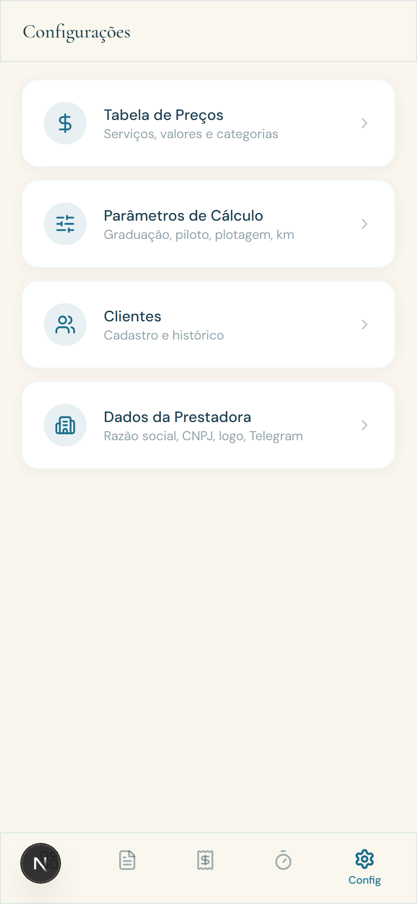

Aqui você gerencia tudo que alimenta os orçamentos:
- **Tabela de Preços** — seus serviços e valores
- **Parâmetros de Cálculo** — percentuais de graduação (25%), piloto (50%), plotagem e km
- **Clientes** — cadastro completo com WhatsApp direto
- **Dados da Prestadora** — nome, CNPJ e observações do orçamento

---

### Tabela de preços

  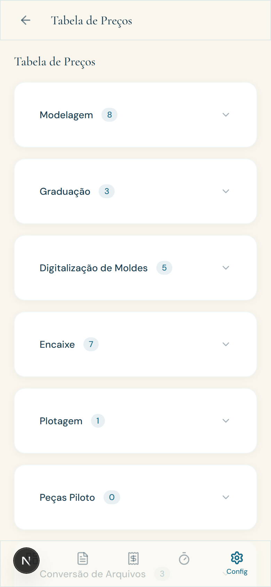

Seus serviços organizados por categoria. Toque no valor para editar na hora. Adicione novos serviços ou remova os que não usa mais. Esses valores são sugeridos automaticamente quando você cria um orçamento.

---

### Seus clientes

  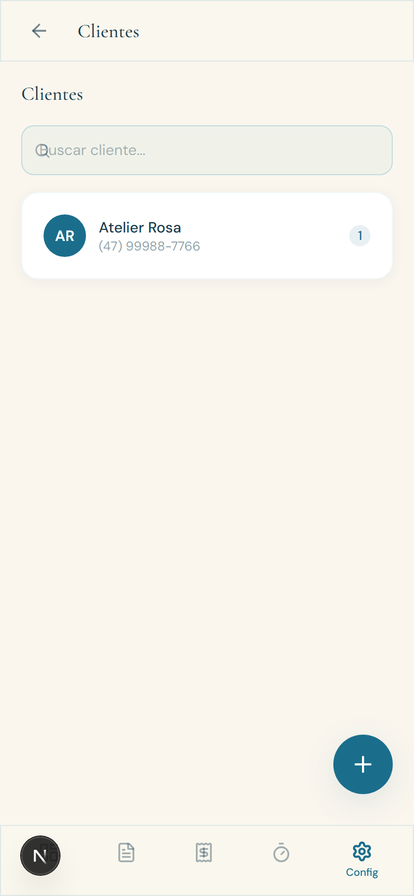

A lista dos seus clientes com busca rápida. Toque em um cliente para ver o histórico de orçamentos, total de receita e contato direto por WhatsApp.

---

## Como criar um orçamento — passo a passo

1. **Toque no botão +** na tela de orçamentos (ou no atalho "Orçamento" do painel)
2. **Selecione o cliente** — digite o nome e escolha da lista. Se for novo, cadastre ali mesmo
3. **Adicione os moldes** — expanda "Modelagem", busque o serviço e o valor já aparece. Ajuste a quantidade
4. **Replique para Graduação** — toque em "Replicar para →" e escolha "Graduação". O app calcula 25% de cada molde automaticamente. Ajuste a quantidade de tamanhos
5. **Revise e crie** — confira os totais, aplique desconto global se quiser e toque em "Criar Orçamento"

Pronto! Agora você pode gerar o PDF e enviar por WhatsApp.

---

## Também funciona no computador

  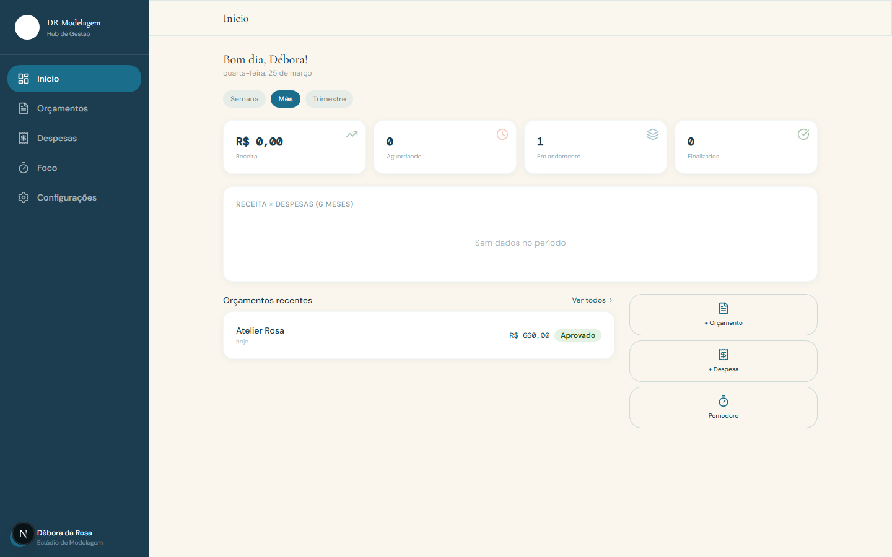

  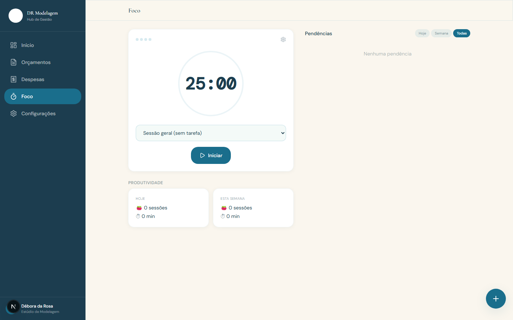

O app se adapta automaticamente — no celular tem navegação na parte de baixo, no computador tem um menu lateral com todas as opções. O timer Pomodoro e as pendências ficam lado a lado, e o painel mostra 4 cards de métricas em vez de 2. Tudo sincronizado.

---

## Dicas rápidas

**1.** Após aprovar um orçamento, uma tarefa aparece automaticamente no Foco. Assim você nunca esquece de iniciar o trabalho.

**2.** O Telegram envia um resumo diário às 8h da manhã com suas pendências, orçamentos sem resposta e sessões de foco do dia anterior.

**3.** Ao criar um orçamento, se o serviço não existe na tabela, cadastre na hora pelo campo de busca. Ele já fica salvo para os próximos orçamentos.

**4.** Use o timer Pomodoro vinculado a uma tarefa. Ao final de 4 sessões, o app sugere uma pausa longa de 15 minutos.

**5.** Todas as suas configurações de preço (graduação 25%, piloto 50%, plotagem R$ 8,50/m) podem ser alteradas a qualquer momento em Configurações → Parâmetros.

---

## Desenvolvido com carinho

Este app foi criado especialmente para o dia a dia do **Estúdio de Modelagem Têxtil da Débora da Rosa**. Cada tela, cada cálculo e cada atalho foi pensado para economizar o seu tempo e deixar seus orçamentos ainda mais profissionais.

*DR Modelagem — Hub de Gestão*
*CNPJ 49.647.364/0001-57*
